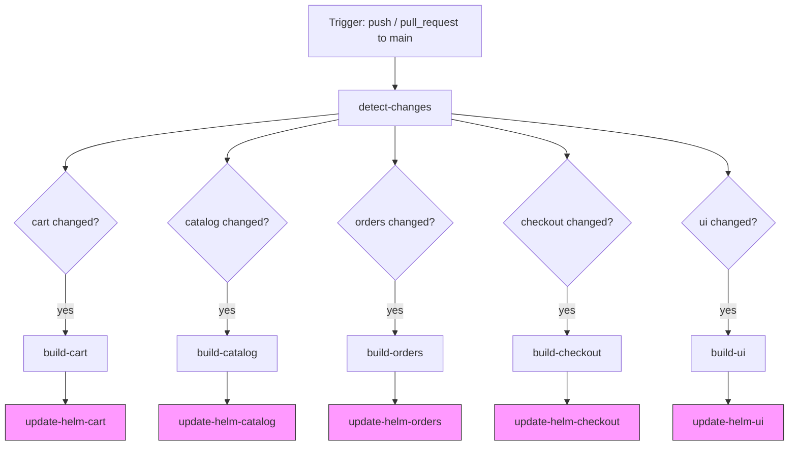

# Design Document: GitHub Actions CI/CD Pipeline

## Overview

This document describes the design for a GitHub Actions CI/CD pipeline that automates Docker image builds and Helm chart updates for the retail store sample application. The pipeline covers five services — `cart`, `catalog`, `orders`, `checkout`, and `ui` — each living under `src/<service>/`.

The pipeline is triggered on pushes and pull requests to `main`. It detects which services have changed, builds Docker images for those services, pushes them to Amazon ECR, and then updates each service's Helm chart `values.yaml` with the new image tag and repository. Each service's build and update jobs run independently so a failure in one service does not block others.

### Key Design Decisions

- **Single workflow file**: All five services are handled in one `.github/workflows/ci.yml` file using a matrix-style approach with per-service jobs. This keeps the pipeline easy to read and maintain without duplicating workflow logic across multiple files.
- **`dorny/paths-filter` for change detection**: This action provides reliable, well-tested path filtering with boolean outputs per filter, avoiding the need to shell-script `git diff` manually.
- **`aws-actions/configure-aws-credentials` + `aws-actions/amazon-ecr-login`**: The official AWS GitHub Actions handle credential configuration and ECR login in a composable, auditable way.
- **`[skip ci]` in commit messages**: Helm update commits include `[skip ci]` to prevent the pipeline from re-triggering on its own commits, avoiding infinite loops.
- **PR guard on Helm updates**: Helm chart commits are gated behind `github.event_name == 'push'` so pull request runs only validate builds without writing back to the repository.

---

## Architecture

The pipeline is structured as a directed acyclic graph (DAG) of jobs:



Pink nodes (Helm update jobs) only run on `push` events, not pull requests.

### Job Dependency Chain (per service)

```
detect-changes → build-<service> → update-helm-<service>
```

Each service's chain is fully independent. A failure in `build-cart` has no effect on `build-catalog` or any other service.

---

## Components and Interfaces

### 1. Workflow File

**Location**: `.github/workflows/ci.yml`

The single workflow file contains:

| Job | Purpose |
|-----|---------|
| `detect-changes` | Runs `dorny/paths-filter` to produce boolean outputs per service |
| `build-<service>` (×5) | Configures AWS credentials, logs in to ECR, builds and pushes Docker image |
| `update-helm-<service>` (×5) | Updates `image.tag` and `image.repository` in `values.yaml`, commits and pushes |

### 2. Change Detection Job

Uses [`dorny/paths-filter@v3`](https://github.com/dorny/paths-filter) to evaluate path filters for each service directory. Outputs a boolean string (`'true'`/`'false'`) per service.

```yaml
- uses: dorny/paths-filter@v3
  id: filter
  with:
    filters: |
      cart:
        - 'src/cart/**'
      catalog:
        - 'src/catalog/**'
      orders:
        - 'src/orders/**'
      checkout:
        - 'src/checkout/**'
      ui:
        - 'src/ui/**'
```

Downstream jobs consume these outputs via `needs.detect-changes.outputs.<service>`.

### 3. Build Jobs

Each build job follows the same sequence of steps:

1. `actions/checkout@v4` — check out the repository
2. `aws-actions/configure-aws-credentials@v4` — configure AWS credentials from secrets
3. `aws-actions/amazon-ecr-login@v2` — authenticate Docker with ECR, outputs `registry`
4. `docker build` — build image from `src/<service>/Dockerfile` with context `src/<service>/`
5. `docker push` — push SHA-tagged image
6. `docker push` — push `latest`-tagged image

The image tag is derived from the triggering commit SHA:

```yaml
IMAGE_TAG: ${{ github.sha }}
# Used as: ${IMAGE_TAG::7}  (first 7 characters)
```

Full image URI format: `<registry>/retail-store-sample-<service>:<sha7>`

### 4. Helm Update Jobs

Each Helm update job:

1. `actions/checkout@v4` — check out the repository
2. Uses `sed` to update `image.tag` and `image.repository` in `src/<service>/chart/values.yaml`
3. Configures git user identity (`github-actions[bot]`)
4. Commits with message: `ci: update <service> image tag to <sha7> [skip ci]`
5. Pushes to `main` using `GITHUB_TOKEN`

The `sed` commands target the specific YAML keys:

```bash
sed -i "s|  tag:.*|  tag: \"${IMAGE_TAG}\"|" src/<service>/chart/values.yaml
sed -i "s|  repository:.*|  repository: \"${ECR_REGISTRY}/retail-store-sample-<service>\"|" src/<service>/chart/values.yaml
```

**Guard condition**: `if: github.event_name == 'push'` — skips the entire job on pull requests.

### 5. Secrets and Variables

| Name | Type | Used By | Purpose |
|------|------|---------|---------|
| `AWS_ACCESS_KEY_ID` | Secret | build jobs | AWS authentication |
| `AWS_SECRET_ACCESS_KEY` | Secret | build jobs | AWS authentication |
| `AWS_REGION` | Secret or Variable | build jobs | ECR region |
| `GITHUB_TOKEN` | Built-in secret | Helm update jobs | Push commits to repo |

---

## Data Models

### Workflow Trigger Configuration

```yaml
on:
  push:
    branches: [main]
  pull_request:
    branches: [main]
```

### Workflow Permissions

```yaml
permissions:
  contents: write      # Required for Helm update job to push commits
  id-token: write      # Supports future OIDC-based AWS authentication
```

### Change Detection Output Schema

The `detect-changes` job exposes outputs consumed by downstream jobs:

```yaml
outputs:
  cart:     ${{ steps.filter.outputs.cart }}
  catalog:  ${{ steps.filter.outputs.catalog }}
  orders:   ${{ steps.filter.outputs.orders }}
  checkout: ${{ steps.filter.outputs.checkout }}
  ui:       ${{ steps.filter.outputs.ui }}
```

Each value is the string `'true'` or `'false'`.

### Build Job Conditional

```yaml
if: needs.detect-changes.outputs.<service> == 'true'
```

### Image Tag Derivation

```bash
IMAGE_TAG="${GITHUB_SHA::7}"
# Example: commit abc1234def → IMAGE_TAG=abc1234
```

### Helm `values.yaml` Fields Updated

For each service, two fields in `src/<service>/chart/values.yaml` are updated:

```yaml
image:
  repository: <account-id>.dkr.ecr.<region>.amazonaws.com/retail-store-sample-<service>
  tag: "<sha7>"
```

Current baseline values (from existing `values.yaml` files):

| Service | Current repository | Current tag |
|---------|-------------------|-------------|
| cart | `public.ecr.aws/aws-containers/retail-store-sample-cart` | `1.2.2` |
| catalog | `public.ecr.aws/aws-containers/retail-store-sample-catalog` | `1.2.2` |
| orders | `public.ecr.aws/aws-containers/retail-store-sample-orders` | `1.2.2` |
| checkout | `public.ecr.aws/aws-containers/retail-store-sample-checkout` | `1.2.2` |
| ui | `public.ecr.aws/aws-containers/retail-store-sample-ui` | `1.2.2` |

After a successful pipeline run, `repository` is updated to the private ECR URI and `tag` is updated to the 7-character commit SHA.

### Commit Message Format

```
ci: update <service> image tag to <sha7> [skip ci]
```

Examples:
- `ci: update cart image tag to abc1234 [skip ci]`
- `ci: update catalog image tag to abc1234 [skip ci]`

---

## Correctness Properties

This feature is a GitHub Actions workflow — declarative YAML configuration that orchestrates external services (GitHub Actions runners, AWS ECR, Docker). The pipeline itself does not contain pure functions with testable input/output behavior. The correctness of the workflow is verified through:

- **Integration testing**: Running the workflow against a real or mocked environment
- **Snapshot/schema validation**: Linting the workflow YAML with `actionlint`
- **Example-based tests**: Verifying specific scenarios (PR skips Helm update, `[skip ci]` prevents re-trigger)

Property-based testing is **not applicable** to this feature because:
1. The workflow is declarative configuration, not a function with inputs/outputs
2. Correctness depends on external service behavior (GitHub Actions, AWS ECR, Docker)
3. Running 100 iterations would require 100 actual CI runs — prohibitively expensive
4. The behavior does not vary meaningfully with arbitrary generated inputs

The testing strategy below covers all acceptance criteria through integration and example-based tests.

---

## Error Handling

### AWS Authentication Failure (Requirement 2.3)

If `AWS_ACCESS_KEY_ID` or `AWS_SECRET_ACCESS_KEY` are invalid or expired, `aws-actions/configure-aws-credentials` will fail with a descriptive error. The job exits immediately; subsequent steps (ECR login, Docker build, push) do not run.

### ECR Login Failure (Requirement 3.3)

If `aws-actions/amazon-ecr-login` fails (e.g., insufficient IAM permissions), the job exits before the Docker build step. The error message from the action identifies the ECR endpoint and the IAM error.

### Docker Build Failure (Requirement 4.5)

If `docker build` exits non-zero, the step fails and the job stops. The push step and Helm update job do not run for that service. Other services' jobs are unaffected.

### Image Push Failure / Missing ECR Repository (Requirements 5.3, 5.4)

If the ECR repository does not exist, `docker push` returns a `repository does not exist` error. The job fails; the Helm update job is not triggered because it depends on the build job succeeding (`needs: build-<service>` with default `success()` condition).

### Missing `image.tag` in `values.yaml` (Requirement 6.5)

The `sed` command targets the pattern `  tag:.*` under the `image:` block. If this key is absent, `sed` makes no substitution and the file is unchanged. A subsequent `git diff --exit-code` check can detect this and fail the job with a descriptive message. This guard should be added to the Helm update step.

### `[skip ci]` Loop Prevention (Requirement 8.4)

GitHub Actions natively skips workflow runs when the commit message contains `[skip ci]`. The Helm update commit message always includes this string, so the pipeline does not re-trigger on its own commits.

### Parallel Failure Isolation (Requirement 7.3)

GitHub Actions jobs are independent by default. A failed `build-cart` job does not cancel `build-catalog` or any other job. Each service's chain fails or succeeds independently.

---

## Testing Strategy

This feature is CI/CD infrastructure. The appropriate testing approach is:

### 1. Workflow Linting (Static Analysis)

Use [`actionlint`](https://github.com/rhysd/actionlint) to statically validate the workflow YAML:

```bash
actionlint .github/workflows/ci.yml
```

This catches:
- Invalid action references
- Incorrect expression syntax (`${{ }}`)
- Missing required inputs for actions
- Type mismatches in job outputs

### 2. Example-Based Integration Tests

These are manual or semi-automated tests run against the actual GitHub Actions environment:

| Test | Scenario | Expected Result |
|------|----------|----------------|
| T1 | Push to `main` modifying only `src/cart/` | Only `build-cart` and `update-helm-cart` run |
| T2 | Push to `main` modifying `src/cart/` and `src/catalog/` | Both service chains run in parallel |
| T3 | Pull request modifying `src/catalog/` | `build-catalog` runs; `update-helm-catalog` is skipped |
| T4 | Push to `main` with no changes to any `src/<service>/` | All build and Helm update jobs are skipped |
| T5 | Push with invalid AWS credentials | `build-*` jobs fail at credential configuration step |
| T6 | Helm update commit triggers pipeline | Pipeline skips all jobs due to `[skip ci]` in commit message |
| T7 | `build-cart` fails (bad Dockerfile) | `update-helm-cart` does not run; other services unaffected |
| T8 | Push modifying all 5 services | All 5 build jobs run in parallel; all 5 Helm update jobs run after their respective builds |

### 3. Smoke Tests (Post-Deployment Verification)

After the pipeline runs successfully:

- Verify ECR repository contains the new image tag
- Verify `src/<service>/chart/values.yaml` contains the updated `image.tag` and `image.repository`
- Verify the commit in `main` has the correct message format with `[skip ci]`

### 4. Unit Tests for Shell Logic

The `sed` substitution commands and SHA truncation logic can be tested locally:

```bash
# Test SHA truncation
GITHUB_SHA="abc1234def5678"
IMAGE_TAG="${GITHUB_SHA::7}"
assert [ "$IMAGE_TAG" = "abc1234" ]

# Test sed substitution on a sample values.yaml
sed -i "s|  tag:.*|  tag: \"abc1234\"|" /tmp/test-values.yaml
grep 'tag: "abc1234"' /tmp/test-values.yaml
```

These can be run as part of a local pre-commit check or a separate shell test script.
