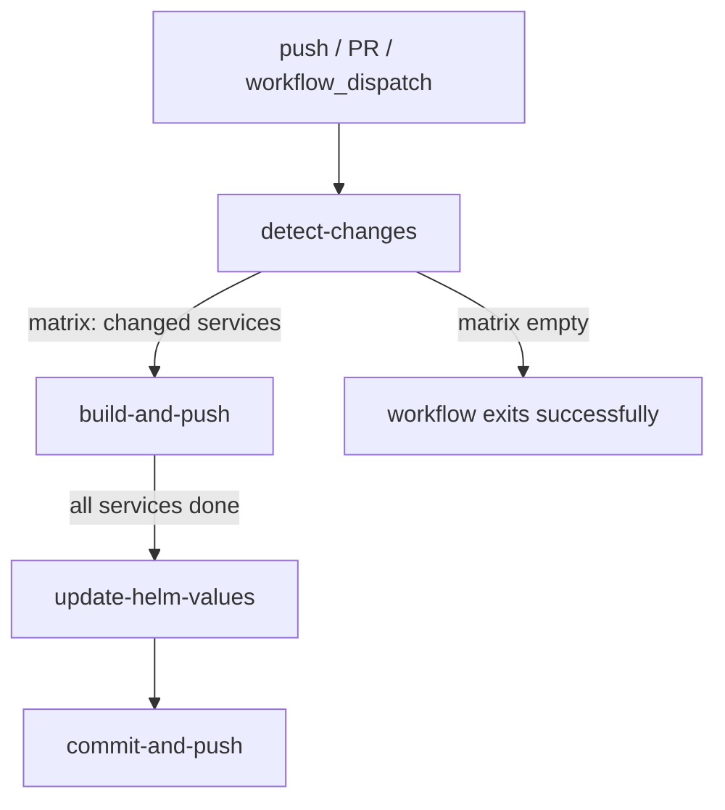

# Design Document: GitHub Actions CI/CD Pipeline

## Overview

This design describes a GitHub Actions CI/CD workflow for the retail store sample application. The workflow automates three concerns on every push to `main`:

1. **Change detection** — determine which of the three services (`cart`, `catalog`, `orders`) have changed files.
2. **Docker build and push** — build each changed service's image and push it to a per-service Amazon ECR repository.
3. **Helm values update** — rewrite `image.tag` and `image.repository` in each changed service's `chart/values.yaml` and commit the result back to `main`.

The workflow also runs in a read-only mode on pull requests (build only, no push, no commit) and supports manual dispatch.

### Key Design Decisions

- **OIDC authentication** — no long-lived AWS credentials are stored; the workflow assumes an IAM role via GitHub OIDC federation.
- **Dynamic matrix** — change detection produces a JSON array that drives a matrix build job, so only affected services consume runner minutes.
- **Single commit for Helm updates** — all `values.yaml` changes from a run are batched into one commit with `[skip ci]` to avoid re-triggering the workflow.
- **Pinned action SHAs** — every third-party action is pinned to a commit SHA to prevent supply-chain attacks.

---

## Architecture

### Workflow Job Graph



### Job Responsibilities

| Job | Runs on | Condition | Responsibility |
|---|---|---|---|
| `detect-changes` | `ubuntu-latest` | always | Diff changed paths, emit JSON matrix |
| `build-and-push` | `ubuntu-latest` | matrix non-empty | Build Docker image, push to ECR (push branch only) |
| `update-helm-values` | `ubuntu-latest` | push to `main` only | Patch `values.yaml`, commit, push with retry |

### Workflow File Location

```
.github/workflows/ci-cd.yml
```

---

## Components and Interfaces

### 1. Change Detector (`detect-changes` job)

Uses `git diff --name-only` between `HEAD` and `HEAD~1` (or the merge base on PRs) to list changed files. Each file path is tested against the prefix `src/<service>/`. The output is a JSON array of service names, e.g. `["cart","orders"]`, set as a job output named `matrix`.

**Inputs:** Git ref context (`github.sha`, `github.event.before`)  
**Outputs:** `matrix` — JSON string, e.g. `{"service":["cart","catalog"]}`

If the array is empty the downstream jobs are skipped via `if: needs.detect-changes.outputs.matrix != '{"service":[]}'`.

### 2. Image Builder / Pusher (`build-and-push` job)

Runs as a matrix job over the services emitted by `detect-changes`. Each matrix instance:

1. Checks out the repository.
2. Authenticates to AWS via OIDC (`aws-actions/configure-aws-credentials`).
3. Logs in to ECR (`aws-actions/amazon-ecr-login`).
4. Builds the Docker image with `docker/build-push-action`, using GitHub Actions cache for layer caching.
5. Tags the image with both the short Git SHA and `latest`.
6. Pushes both tags (skipped on pull requests).
7. Writes per-service outputs (`image_tag`, `ecr_uri`) consumed by the Helm updater.

**Inputs:** `matrix.service`, `github.sha`, `AWS_ROLE_ARN` secret, `AWS_REGION` variable  
**Outputs:** `image_tag` (short SHA), `ecr_uri` (full ECR repository URI)

### 3. Helm Values Updater (`update-helm-values` job)

Runs once after all matrix instances of `build-and-push` complete, only on pushes to `main`. It:

1. Checks out the repository with a token that allows pushing.
2. Iterates over each service that was built.
3. Uses `sed` (or `yq`) to patch `image.tag` and `image.repository` in `src/<service>/chart/values.yaml`.
4. Stages all changed `values.yaml` files.
5. Commits with message `chore: update <services> image tag to <sha> [skip ci]`.
6. Pushes to `main`, retrying up to 3 times with `git pull --rebase` on conflict.

**Inputs:** outputs from `build-and-push` matrix jobs, `GITHUB_TOKEN`  
**Side effects:** one git commit pushed to `main`

### 4. Job Summary Writer

Each job appends a Markdown table row to `$GITHUB_STEP_SUMMARY`:

```
| Service | Image Tag | ECR URI | Status |
```

Skipped services are included with status `skipped`.

### 5. GitHub Actions Secrets and Variables

| Name | Type | Purpose |
|---|---|---|
| `AWS_ROLE_ARN` | Secret | IAM role ARN for OIDC assumption |
| `AWS_REGION` | Variable | AWS region (e.g. `us-east-1`) |
| `GITHUB_TOKEN` | Built-in | Commit and push Helm updates |

---

## Data Models

### Service Descriptor

Each service is described by a static configuration embedded in the workflow:

```yaml
services:
  cart:
    path: src/cart
    dockerfile: src/cart/Dockerfile
    ecr_repo: retail-store-sample-cart
    values_yaml: src/cart/chart/values.yaml
  catalog:
    path: src/catalog
    dockerfile: src/catalog/Dockerfile
    ecr_repo: retail-store-sample-catalog
    values_yaml: src/catalog/chart/values.yaml
  orders:
    path: src/orders
    dockerfile: src/orders/Dockerfile
    ecr_repo: retail-store-sample-orders
    values_yaml: src/orders/chart/values.yaml
```

### Change Detection Output

```json
{
  "service": ["cart", "catalog"]
}
```

An empty result looks like `{"service":[]}` and causes downstream jobs to be skipped.

### Image Tag Format

```
<short-git-sha>          # e.g. a1b2c3d  (7 hex chars from git rev-parse --short HEAD)
latest
```

### ECR Repository URI Pattern

```
<aws-account-id>.dkr.ecr.<aws-region>.amazonaws.com/retail-store-sample-<service>
```

Example: `123456789012.dkr.ecr.us-east-1.amazonaws.com/retail-store-sample-cart`

### Helm `values.yaml` Patch (per service)

Before:
```yaml
image:
  repository: public.ecr.aws/aws-containers/retail-store-sample-cart
  tag: "1.2.2"
```

After:
```yaml
image:
  repository: 123456789012.dkr.ecr.us-east-1.amazonaws.com/retail-store-sample-cart
  tag: "a1b2c3d"
```

The patch is applied with `yq e '.image.tag = "<tag>" | .image.repository = "<uri>"' -i values.yaml` to avoid fragile regex-based `sed` on YAML.

### Git Commit Message Format

```
chore: update cart,orders image tag to a1b2c3d [skip ci]
```

When only one service is updated:
```
chore: update catalog image tag to a1b2c3d [skip ci]
```

---

## Correctness Properties

*A property is a characteristic or behavior that should hold true across all valid executions of a system — essentially, a formal statement about what the system should do. Properties serve as the bridge between human-readable specifications and machine-verifiable correctness guarantees.*

### Property 1: Change Detection Correctness

*For any* set of changed file paths, the change detector SHALL produce a matrix that contains a service if and only if at least one path in the input set has that service's path prefix (`src/cart/`, `src/catalog/`, or `src/orders/`). No service appears in the matrix unless its prefix is present; no service is omitted when its prefix is present.

**Validates: Requirements 2.1, 2.2, 2.3, 2.4**

### Property 2: Image Tag Derivation

*For any* full 40-character Git SHA string, the derived Image_Tag SHALL be a 7-character string that is a prefix of the full SHA and consists only of hexadecimal characters.

**Validates: Requirements 3.3**

### Property 3: ECR Repository URI Construction

*For any* valid AWS account ID (12-digit string), AWS region string, and service name, the constructed ECR_Repository URI SHALL match the pattern `<account-id>.dkr.ecr.<region>.amazonaws.com/retail-store-sample-<service>` exactly.

**Validates: Requirements 5.4**

### Property 4: Helm Values Patch Preserves Structure

*For any* valid `values.yaml` content, new image tag string, and new ECR repository URI, applying the Helm_Updater patch SHALL produce a YAML document where `image.tag` equals the new tag, `image.repository` equals the new URI, and all other top-level and nested fields are unchanged from the original.

**Validates: Requirements 6.1, 6.2**

### Property 5: Commit Message Format

*For any* non-empty list of service names and any image tag string, the generated commit message SHALL start with `chore: update`, contain all service names, contain the image tag, and end with `[skip ci]`.

**Validates: Requirements 6.3, 6.4**

### Property 6: Single Commit for Multiple Services

*For any* non-empty list of 1 to 3 changed services in a single workflow run, the Helm_Updater SHALL produce exactly one git commit regardless of how many services are in the list.

**Validates: Requirements 6.5**

### Property 7: Job Summary Completeness

*For any* workflow run result containing a list of service outcomes (built, pushed, or skipped), the generated job summary SHALL contain one row per service, and each row SHALL include the service name, its Image_Tag (or "—" if skipped), the ECR_Repository URI (or "—" if skipped), and its status.

**Validates: Requirements 7.1, 7.2**

### Property 8: Action SHA Pinning

*For any* action reference in the workflow YAML (lines matching `uses: <owner>/<repo>@<ref>`), the `<ref>` component SHALL be a 40-character lowercase hexadecimal string (a full Git commit SHA), not a mutable tag or branch name.

**Validates: Requirements 8.1**

---

## Error Handling

### Build Failures

- If `docker build` exits non-zero, the matrix job for that service fails immediately. Other matrix instances continue independently.
- The failure is surfaced in the GitHub Actions UI and blocks any branch protection rules configured on the workflow.

### ECR Push Failures

- If `docker push` fails (network error, permission denied, repository not found), the matrix job fails before reaching the Helm update step.
- The Helm update job depends on all matrix instances succeeding (`needs: build-and-push` with default `success()` condition), so a push failure prevents any Helm commit.

### Helm Commit Conflicts

- If `git push` is rejected due to a concurrent commit (another workflow run or a direct push), the Helm updater performs `git pull --rebase origin main` and retries the push.
- The retry loop runs up to 3 times. After 3 failures the job exits with a non-zero code.
- The retry is implemented as a shell loop:

```bash
for i in 1 2 3; do
  git push origin main && break
  if [ $i -lt 3 ]; then
    git pull --rebase origin main
  else
    echo "Push failed after 3 attempts"
    exit 1
  fi
done
```

### Empty Matrix

- When `detect-changes` produces `{"service":[]}`, the `build-and-push` and `update-helm-values` jobs are skipped via an `if:` condition.
- The workflow exits with a green status so that branch protection is not blocked.

### AWS Authentication Failures

- If `configure-aws-credentials` fails (invalid role ARN, OIDC misconfiguration, expired token), the step exits non-zero and the job fails immediately.
- No subsequent steps (ECR login, docker push, Helm update) execute.

---

## Testing Strategy

### Overview

This feature is a GitHub Actions workflow — primarily declarative YAML configuration with small shell script fragments for change detection, YAML patching, commit message generation, and summary writing. The testable logic lives in these shell/script components, not in the workflow runner itself.

**PBT applicability assessment:** The workflow YAML itself (trigger config, job structure, action references) is infrastructure configuration — not suitable for property-based testing. However, the *logic components* embedded in the workflow (change detection, URI construction, YAML patching, commit message formatting, summary generation) are pure functions with meaningful input variation. PBT applies to these components.

### Unit and Property Tests

Extract the logic components into standalone shell scripts or a small helper script (e.g., `scripts/ci/helpers.sh`) that can be tested in isolation with [Bats](https://github.com/bats-core/bats-core) (Bash Automated Testing System) and [Hypothesis](https://hypothesis.readthedocs.io/) or [fast-check](https://fast-check.dev/) for property generation if a Node/Python harness is preferred.

**Property-based tests** (minimum 100 iterations each):

| Property | Test approach |
|---|---|
| P1: Change detection correctness | Generate random file path lists; assert matrix = services with matching prefixes |
| P2: Image tag derivation | Generate random 40-char hex strings; assert output is 7-char prefix |
| P3: ECR URI construction | Generate random account IDs, regions, service names; assert URI pattern |
| P4: Helm values patch | Generate random `values.yaml` + tag + repo; assert patched fields correct, others unchanged |
| P5: Commit message format | Generate random service lists + tags; assert message structure |
| P6: Single commit | Generate 1–3 service lists; assert commit count = 1 |
| P7: Summary completeness | Generate random service outcome lists; assert all rows present with correct fields |
| P8: Action SHA pinning | Parse workflow YAML; assert all `uses:` refs are 40-char hex |

Each property test MUST be tagged:
```
# Feature: github-actions-cicd, Property <N>: <property_text>
```

**Example-based unit tests:**

- Empty matrix → workflow exits successfully (Requirement 2.5)
- Retry logic: 1 failure then success → job succeeds; 3 failures → job fails (Requirement 6.6)
- PR event → push and commit steps are skipped (Requirements 5.6, 6.7)

### Smoke Tests (Workflow YAML Static Analysis)

Use a YAML parser (e.g., `yq` or Python `pyyaml`) to assert structural properties of the workflow file:

- Trigger block contains `push: branches: [main]`, `pull_request: branches: [main]`, and `workflow_dispatch`.
- Permissions block contains `contents: write`, `id-token: write`, `pull-requests: read`.
- All `uses:` references are pinned to 40-char SHAs (overlaps with Property 8).
- Push and commit steps have `if: github.event_name != 'pull_request'` conditions.
- `aws-actions/configure-aws-credentials` step uses `role-to-assume: ${{ secrets.AWS_ROLE_ARN }}`.
- `aws-actions/amazon-ecr-login` step is present in the build job.

### Integration Tests

Run against a real (or localstack-mocked) AWS environment:

- Trigger a workflow run on a test branch; verify the correct ECR image appears with the expected tag.
- Verify the `latest` tag is also pushed.
- Verify `values.yaml` is updated in the repository after a successful push run.
- Verify no `values.yaml` commit is made on a PR run.

### Test Configuration

- Property tests: minimum **100 iterations** per property.
- Bats tests run in CI as a separate job (`test-helpers`) that does not require AWS credentials.
- Integration tests run only on the `main` branch and require the `AWS_ROLE_ARN` secret.
